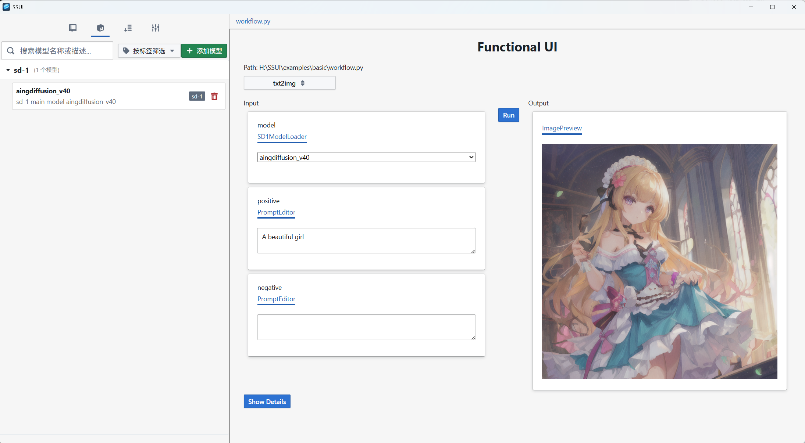

Stable Scripts UI
====================

Stable Scripts UI is a web-based user interface for `Stable Scripts` - a kind of python scripts can easily reproduce the same results by other users.





## Why Stable Scripts?

Comparing to other stable diffusion UI, SSUI has 5 major pros:

- **Easy to use**: Quickly create, run, and share stable scripts, which is self-contained and can automatically download the necessary python modules, AI models and other dependent data.
- **Reproducible**: Scripts, its necessary modules, and the SSUI itself are versioned. Scripts can be run in the exactly same environment as the script author.
- **Management**: Manage your models and configurations 
- **Strong Typed**: All resources (include models) are strong types and can be prevented from being misused.
- **Customizable**: You can customize the scripts, types, models, panels, loaders, ui framework and more.


## Types

- DiffusionModel
  - SD1
  - SDXL
    - Pony
    - Illustrious
  - Flux
- Clip
- VAE
- Latent
- Image
- Mask
- ControlNet
- Conditioning


## Setup Development Environment

### Dependencies

First, please check out the dependencies are installed on your device.

- nodejs and yarn
  - Please download from: https://nodejs.org/en/download
  - npm install --global yarn

- rustc and cargo
  - Please check out https://www.rust-lang.org/tools/install


### Nodejs & Python Environment

The following command will install yarn packages and a embedded python environment in '.venv' and necessary python packages for you.

```bash
yarn
```


### Run Development Server

```bash
yarn dev:server
yarn dev:functional_ui
yarn dev:desktop
```

Then start a executor for running the task:
```bash
yarn dev:executor
```

- Application server: http://127.0.0.1:7422/
- API documentation server: http://127.0.0.1:7422/docs
- Web UI dev server: http://127.0.0.1:7420/

### Run the example

Example URL: 
```
http://127.0.0.1:7420/?path=<example_path>/basic/workflow-sd1.py
```