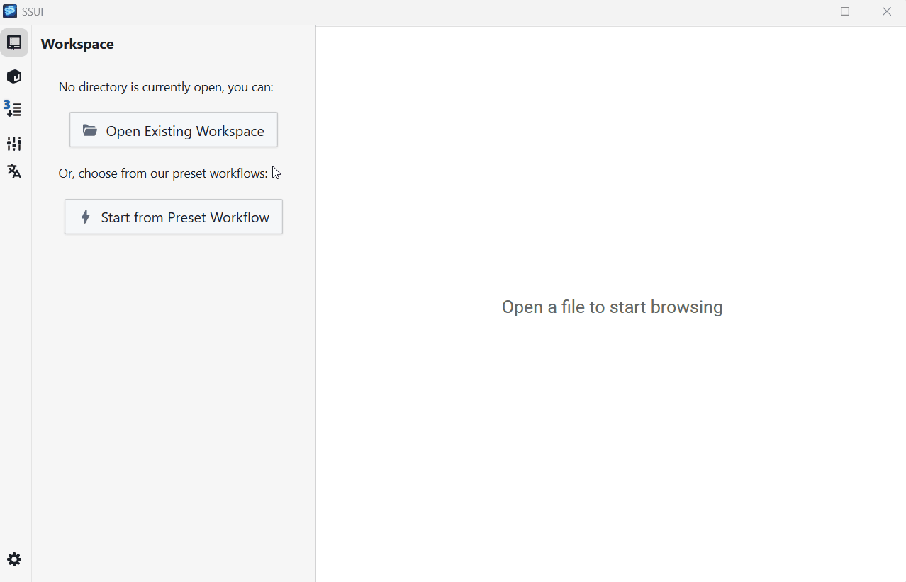

Stable Scripts UI
====================

 [中文Readme](Readme.zh.md)

Stable Scripts UI is a web-based user interface for `Stable Scripts` - a kind of python scripts can easily reproduce the same results created by other users to run GenAI models.


## Why Stable Scripts?

Comparing to other stable diffusion / GenAI UIs, SSUI has 5 major pros:

- **Easy to use**: Quickly create, run, and share stable scripts, which is self-contained and can automatically download the necessary python modules, AI models and other dependent data.
- **Reproducible**: Scripts, its necessary modules, and the SSUI itself are versioned. Scripts can be run in the exactly same environment as the script author.
- **Management**: Manage your models and configurations in a centralized place.
- **Strong Typed**: All resources (include models) are strong types and can be prevented from being misused.
- **Customizable**: You can customize the scripts, types, models, panels, loaders, ui framework and more.

### Project Management

Currently, most of the GenAI tools are node-based, which is not friendly for large scale workflows. SSUI provides a project management system, which contains all the necessary information to run the script. 

With SSUI, you can copy the project and shared with your friends. They can easily reproduce the results with all necessary resources.



### Model Management

SSUI provides a model management system, can help you easily download and install models from Civitai, HuggingFace and local files.


### Better Integration

Stable Scripts provides good integration ability, which can allow you to use in different scenarios. Once a script is written, it can be called by:
1. Other scripts
2. In functional UI
3. In Canvas - if the input and output of the function contains Images.
4. In other extensions 


### Developer Tools

We provides a VSCode plugin to help you write Stable Scripts. You can edit the code, and run the script inside VSCode.


## How to write Stable Scripts?

Please refer to [Stable Scripts](doc/StableScripts.en.md) document for details.

Currently supported models:
- SD1
- SDXL
- Flux

A Stable Script must contains 3 parts:

### 1. Including the necessary modules
```python
from ssui import workflow, Prompt, Image, Noise
from ssui_image.SD1 import SD1Model, SD1Clip, SD1Latent, SD1Lora, SD1Denoise, SD1LatentDecode, SD1IPAdapter
from ssui.config import SSUIConfig
from typing import List, Tuple
```

### 2. Define a config object
```python
config = SSUIConfig()
```

### 3. Define a workflow function, with all the necessary type hints. And those type hints will be used to generate the UI.
```python
@workflow
def txt2img(model: SD1Model, positive: Prompt, negative: Prompt) -> Image:
    positive, negative = SD1Clip(config("Prompt To Condition"), model, positive, negative)
    latent = SD1Latent(config("Create Empty Latent"))
    latent = SD1Denoise(config("Denoise"), model, latent, positive, negative)
    return SD1LatentDecode(config("Latent to Image"), latent)
```

The config object will define each step in the workflow, you must pass it as the first argument of each API calls:

```python
latent = SD1Latent(config("Create Empty Latent"))
```
If there are configurable parameters, those controls will be generated in the details panel in the UI.


## Setup Development Environment

### Dependencies

First, please check out the dependencies are installed on your device.

- nodejs and yarn
  - Please download from: https://nodejs.org/en/download
  - npm install --global yarn

- rustc and cargo
  - Please check out https://www.rust-lang.org/tools/install


### Nodejs & Python Environment

The following command will install yarn packages and a embedded python environment in '.venv' and necessary python packages for you.

```bash
yarn
```


### Run Development Server

To quickly start the development, you can run desktop project as the entry point:
```bash
yarn dev:desktop
```

Or start additional hot reload servers for Functional UI development:
```bash
yarn dev:desktop
yarn dev:functional_ui
```

Or you can start the server, executor, functional ui and desktop all manually, which can give you more flexibility, and clear messages:

```bash
yarn dev:server
yarn dev:executor
yarn dev:functional_ui
yarn dev:desktop
```

- Application server: http://localhost:7422/
- API documentation server: http://localhost:7422/docs
- Functional UI dev server: http://localhost:7420/

### Run the example without the desktop project

If you are working on the functional ui, you can run it directly from the web browser:

```bash
yarn dev:server
yarn dev:executor
yarn dev:functional_ui
```

Example URL: 
```
http://localhost:7420/?path=<example_path>/basic/workflow-sd1.py
```

### Download the testing models

To test the image generation, you need the following models, including:

- SD1.5
- SDXL
- Flux

You can download them from:
https://huggingface.co/datasets/sunxfancy/TestSDModels/tree/main


### Use Git Hooks to check the code before commit

We use [pre-commit](https://git-scm.com/book/ms/v2/Customizing-Git-Git-Hooks) to check the code before commit.

```bash
git config --local core.hooksPath .githooks/
```
