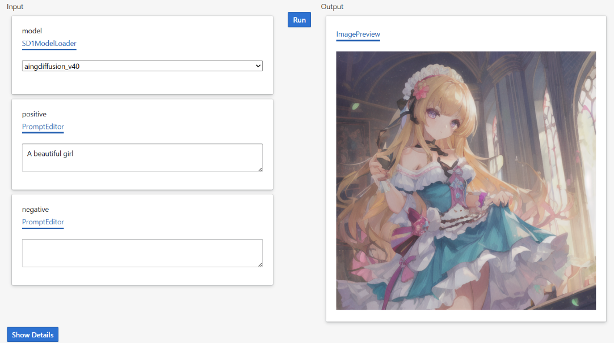

# About StableScripts

Stable Scripts are Python scripts for Stable Diffusion that shield dangerous API calls, can be safely shared over the network, and stably reproduce another user's work.

## Why Use Python Scripts?

Compared to traditional Node-based Stable Diffusion UI, Stable Scripts have the following advantages:

- Good abstraction capability, can implement complex workflows with shorter code
- High reusability, functions in one script can be called by other scripts
- More powerful type system, script functions must include type definitions, leveraging Python's type system to enable inheritance and polymorphism

Compared to directly using Python APIs, Stable Scripts have the following advantages:

- More secure, Stable Scripts shield dangerous API calls, scripts downloaded from the network can be run more safely locally
- More stable, Stable Scripts must be used in clearly defined projects. When users share scripts, all dependent models, configurations, and parameter information are packaged together. If users use custom resources, they are also packaged together, ensuring another user can stably reproduce another user's work

## How to Write a Stable Scripts?

Start with examples, you can refer to the scripts in the [examples](../examples/basic/) directory to understand how to write a Stable Scripts.

Directory structure is as follows:

```
examples/basic/
├── workflow-sd1.py
├── workflow-sdxl.py
├── workflow-flux.py
├── ssproject.yaml
```

Stable Scripts must be defined under a project, and the project root directory must contain an `ssproject.yaml` file to define project information.

The `ssproject.yaml` file content is as follows:

```yaml
ssui_version: 0.1.0
dependencies:
    - <package_name> = <version>
```
If third-party Python dependency packages are used, they must be declared in this file, otherwise they cannot be referenced.

Write a workflow-xx.py file to define the Stable Scripts workflow.

```python
from ssui import workflow, Prompt, Image, Noise
from ssui.config import SSUIConfig
from ssui_image.SD1 import SD1Model, SD1Clip, SD1Latent, SD1Denoise, SD1LatentDecode

config = SSUIConfig()

@workflow
def txt2img(model: SD1Model, positive: Prompt, negative: Prompt) -> Image:
    positive, negative = SD1Clip(config("Prompt To Condition"), model, positive, negative)
    latent = SD1Latent(config("Create Empty Latent"))
    latent = SD1Denoise(config("Denoise"), model, latent, positive, negative)
    return SD1LatentDecode(config("Latent to Image"), model, latent)
```

This script imports the ssui library and ssui_image library for defining Stable Scripts configurations.

If a function is defined as `@workflow`, then this function is an entry point for the workflow and can be displayed in the UI. For example, the above function accepts an SD1Model, two Prompts, and returns an Image. Then in the UI it will be displayed as follows:



In our UI system, all UI controls are automatically generated based on the function's parameters and return value types.

## Configuration System

Obviously, not all parameters need to be passed as function parameters. Many configurations are very complex, and if all are passed as parameters, the interface would be very bloated. We provide a configuration system for managing configurations. You may have noticed that in the example code above, we have a global variable `config` for managing configurations.

```python
config = SSUIConfig()
```

This configuration will be displayed when you click 'Show Details' to show the detailed configuration of this workflow.

We require that each function call must specify the configuration group used for the current call, such as:

```python
SD1Clip(config("Prompt To Condition"), model, positive, negative)
```
Here, a configuration group named `Prompt To Condition` will be displayed in the UI, and all configurations related to this API call will be displayed in this configuration group.

 